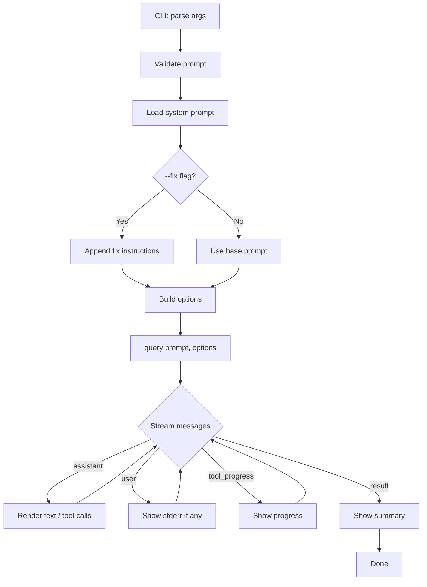
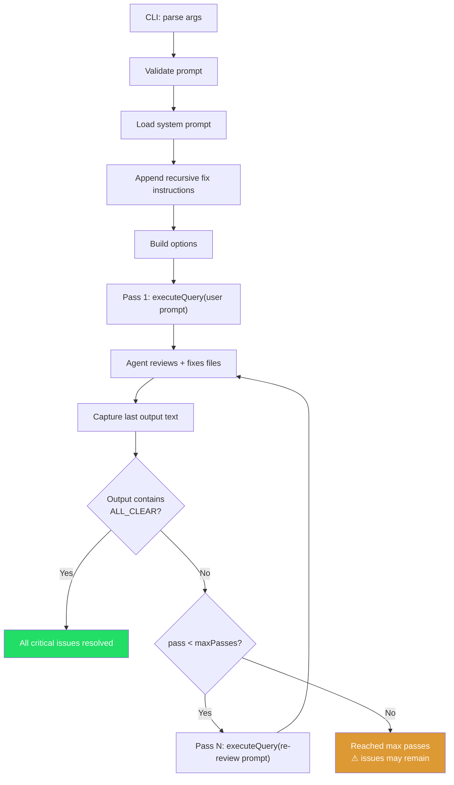

# Code Review Agent

A code review and audit CLI tool powered by the Claude Agent SDK. It analyzes codebases for bugs, security issues, performance problems, and maintainability concerns — all from your terminal.

## Prerequisites

- **Node.js** v18+
- An **Anthropic API key** — get one from the [Claude Console](https://platform.claude.com/)

## Setup

### From source

```bash
git clone <your-repo-url>
cd my-first-agent
npm install
```

### As an npm package

```bash
npm install -g code-review-agent
```

Then run from any project directory:

```bash
code-review-agent "Review this codebase"
code-review-agent --fix-recursive
```

### Authentication

This tool uses the **Claude Agent SDK**, which calls the Anthropic API directly. You need an `ANTHROPIC_API_KEY` set in your environment.

**Add it to your shell profile** (recommended — works for both npm and source installs):

```bash
# Add to ~/.bashrc, ~/.zshrc, or ~/.bash_profile
export ANTHROPIC_API_KEY=your-api-key
```

Then reload your shell (`source ~/.zshrc`) or open a new terminal.

**Or pass it inline** for a single run:

```bash
ANTHROPIC_API_KEY=your-api-key code-review-agent "Review this codebase"
```

**Or use a `.env` file** (when running from source only):

```bash
echo "ANTHROPIC_API_KEY=your-api-key" > .env
```

The SDK also supports third-party API providers:

- **Amazon Bedrock**: set `CLAUDE_CODE_USE_BEDROCK=1` and configure AWS credentials
- **Google Vertex AI**: set `CLAUDE_CODE_USE_VERTEX=1` and configure Google Cloud credentials

## Usage

### Quick start

Run with no arguments to explore and review the current directory:

```bash
npm start
```

Or pass a specific prompt:

```bash
npx tsx index.ts "Review utils.py for bugs"
```

With npm start:

```bash
npm start -- "Review the authentication module"
```

### Fix mode

Use `--fix` to have the agent apply its recommended fixes directly to your source files:

```bash
npx tsx index.ts --fix "Review utils.py for bugs"
```

The agent will review the code, then edit the files to fix Critical and Warning issues.

### Recursive fix mode

Use `--fix-recursive` to run a review/fix loop that keeps going until there are no more critical issues:

```bash
npx tsx index.ts --fix-recursive "Review all source files"
```

Each pass reviews the code, applies fixes, then re-reviews the modified files to catch any issues introduced by the fixes. The loop stops when the agent reports all clear or the pass limit is reached.

Control the maximum number of passes with `--max-passes` (default: 5):

```bash
npx tsx index.ts --fix-recursive --max-passes 3 "Audit agent.ts"
```

### Options

| Flag | Description | Default |
|------|-------------|---------|
| `-m, --model <model>` | Claude model to use | `claude-sonnet-4-5-20250929` |
| `-t, --tools <tools>` | Comma-separated list of allowed tools | `Read,Edit,Glob,Grep,Write,Bash` |
| `-p, --permission-mode <mode>` | `default`, `acceptEdits`, or `bypassPermissions` | `acceptEdits` |
| `--max-turns <n>` | Maximum number of agentic turns | unlimited |
| `--fix` | Apply recommended fixes to source files | off |
| `--fix-recursive` | Review, fix, re-review until no critical issues remain | off |
| `--max-passes <n>` | Max review/fix passes for `--fix-recursive` | `5` |
| `--cwd <dir>` | Working directory for the agent | current directory |

### Examples

```bash
# Review only (report issues, don't touch files)
npx tsx index.ts "Review src/ for security issues" -t Read,Glob,Grep

# Review and fix in one pass
npx tsx index.ts --fix "Find and fix bugs in utils.py"

# Recursive fix until clean
npx tsx index.ts --fix-recursive "Audit this codebase"

# Recursive fix with limited passes and a specific directory
npx tsx index.ts --fix-recursive --max-passes 3 --cwd ./src "Review all files"

# Use a different model
npx tsx index.ts "Audit this codebase" -m claude-sonnet-4-5-20250929

# Full permissions (use with caution)
npx tsx index.ts --fix "Fix all critical bugs" -p bypassPermissions
```

## Architecture

```
my-first-agent/
├── index.ts              # CLI entry point — parses args, calls agent
├── agent.ts              # Core agent — identity, tools, prompt, runs query()
├── prompts/
│   └── system.md         # System prompt — agent identity and behavior
├── skills/
│   └── code-review.md    # Code review methodology (loaded at startup)
├── utils/
│   ├── display.ts        # Message rendering for the terminal
│   └── formatting.ts     # String helpers (truncation, tool formatting)
├── marked-terminal.d.ts  # Type declaration for marked-terminal
├── package.json
└── tsconfig.json
```

### How it works

**`index.ts`** — Thin CLI entry point. Uses Commander to parse arguments and options, then calls `runAgent()`.

**`agent.ts`** — Core agent module. Loads the system prompt from `prompts/system.md`, configures tools, and streams output through `showMessage()`. Supports three modes:

- **Review only** (default) — runs a single review pass
- **`--fix`** — appends fix-mode instructions to the system prompt so the agent edits files after reviewing
- **`--fix-recursive`** — runs the agent in a loop: review, fix, re-review modified files, repeat until `ALL_CLEAR` or max passes reached

**`prompts/system.md`** — Defines who the agent is and how it behaves. This is what makes it a code review agent rather than a generic CLI tool.

**`skills/`** — Skill files (`.md`) loaded at startup and appended to the system prompt. Each file adds a specific capability. Drop in a new `.md` file to extend the agent — no code changes needed.

### Message streaming

The agent uses an async iterator from `query()`. Each message has a `type`:

- **`assistant`** — Claude's response. Contains text blocks and tool-use blocks.
- **`user`** — Tool results returned to Claude (stderr shown for Bash).
- **`tool_progress`** — Progress updates for long-running tools.
- **`result`** — Final message with stats (turns, duration, cost).

### Environment variables

| Variable | Description | Default |
|----------|-------------|---------|
| `ANTHROPIC_API_KEY` | Your Anthropic API key (required) | — |
| `MAX_PROMPT_LENGTH` | Maximum allowed prompt length in characters (capped at 100,000) | `50000` |
| `DEBUG` | Show stack traces and verbose error output | off |

## Flow Diagrams

### Normal mode (`--fix` or no flags)



### Recursive fix mode (`--fix-recursive`)



## Adding Skills

Drop a `.md` file into the `skills/` directory. It will be loaded automatically at startup and appended to the system prompt.

For example, to add a dependency audit skill:

```bash
cat > skills/dependency-audit.md << 'EOF'
# Dependency Audit

When asked to audit dependencies, follow this process.

## Process
1. Read package.json (or requirements.txt, go.mod, etc.)
2. Run the appropriate audit command (npm audit, pip audit, etc.)
3. Check for outdated packages
4. Flag packages with restrictive or incompatible licenses

## Output Format
For each issue found:
- **Package**: name and version
- **Severity**: Critical / High / Medium / Low
- **Issue**: what's wrong
- **Fix**: recommended action
EOF
```

Skills are loaded alphabetically by filename.
