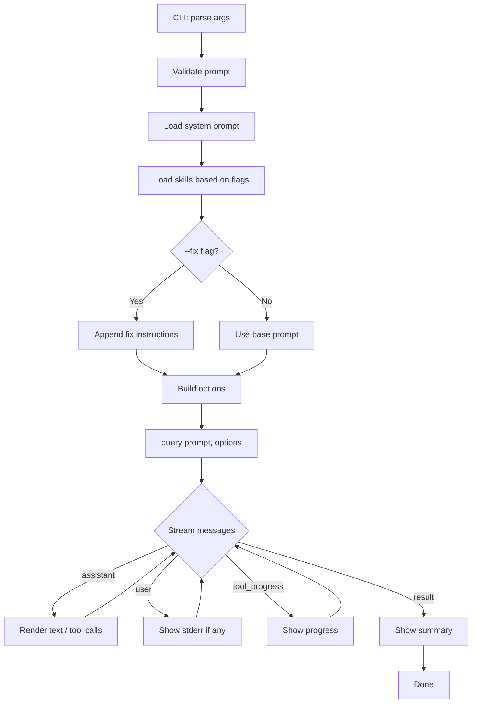
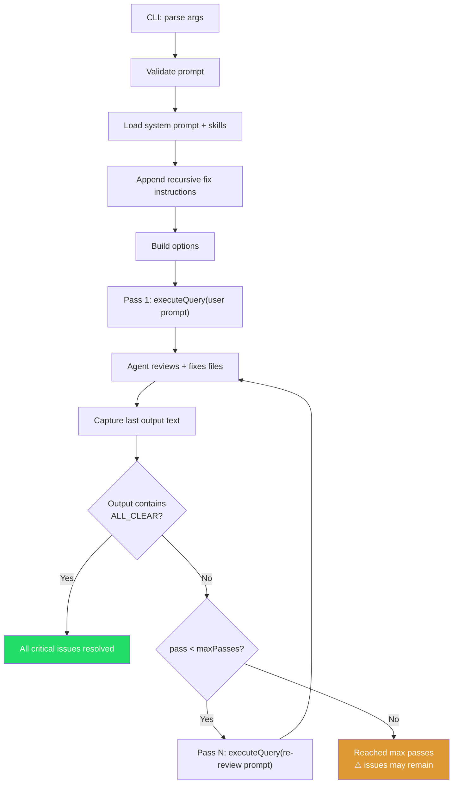

# Code Review Agent CLI

A code review and audit CLI tool powered by the Claude Agent SDK. It analyzes codebases for bugs, security issues, performance problems, and maintainability concerns — all from your terminal.

## Prerequisites

- **Node.js** v18+
- An **Anthropic API key** — get one from the [Claude Console](https://platform.claude.com/)

## Install

```bash
npm install -g code-review-agent-cli
```

## Authentication

Set your API key in your shell profile (persists across sessions):

```bash
echo 'export ANTHROPIC_API_KEY=your-api-key' >> ~/.zshrc
source ~/.zshrc
```

Or pass it inline for a single run:

```bash
ANTHROPIC_API_KEY=your-api-key code-review-agent-cli
```

The SDK also supports:

- **Amazon Bedrock**: set `CLAUDE_CODE_USE_BEDROCK=1` and configure AWS credentials
- **Google Vertex AI**: set `CLAUDE_CODE_USE_VERTEX=1` and configure Google Cloud credentials

## Quick Start

Run with no arguments to review the current directory:

```bash
code-review-agent-cli
```

Or pass a specific prompt:

```bash
code-review-agent-cli "Review the authentication module"
```

## Review Skills

The agent ships with modular skills that you enable with flags. The core review skill is always active. Additional skills add specialized checks:

| Flag | Skill | What it does |
|------|-------|-------------|
| *(always on)* | Code Review | Bugs, security, error handling, performance, maintainability, dead code |
| `--security` | Security Audit | OWASP Top 10 checks, CWE identification, attack scenarios, secrets detection |
| `--clean-code` | Clean Code | Clean Code principles, code smells, named refactoring patterns (Fowler) |
| `--test-review` | Testing Review | Test coverage gaps, test quality, isolation, edge cases, mock patterns |
| `--details` | Detailed Review | Educational explanations: why it matters, best practice rationale, learn more links |

Skills are combinable — use as many as you need:

```bash
# Standard review (bugs, security, performance, maintainability)
code-review-agent-cli

# Deep security audit
code-review-agent-cli --security

# Clean Code review with refactoring suggestions
code-review-agent-cli --clean-code

# Test quality assessment
code-review-agent-cli --test-review

# Full review with detailed explanations for learning
code-review-agent-cli --security --clean-code --details

# List all available skills
code-review-agent-cli --list-skills
```

## Fix Mode

### Single pass

Use `--fix` to have the agent apply fixes directly to your source files:

```bash
code-review-agent-cli --fix "Review utils.py for bugs"
```

Combine with any skill:

```bash
code-review-agent-cli --fix --security "Audit this codebase"
code-review-agent-cli --fix --clean-code
```

### Recursive fix

Use `--fix-recursive` to run a review/fix loop until there are no more critical issues:

```bash
code-review-agent-cli --fix-recursive
```

Each pass reviews the code, applies fixes, then re-reviews modified files to catch issues introduced by the fixes. The loop stops when the agent reports all clear or the pass limit is reached.

```bash
# Limit to 3 passes
code-review-agent-cli --fix-recursive --max-passes 3

# Fix a specific directory
code-review-agent-cli --fix-recursive --cwd ./src
```

## All Options

| Flag | Description | Default |
|------|-------------|---------|
| `-m, --model <model>` | Claude model to use | `claude-sonnet-4-5-20250929` |
| `-t, --tools <tools>` | Comma-separated list of allowed tools | `Read,Edit,Glob,Grep,Write,Bash` |
| `-p, --permission-mode <mode>` | `default`, `acceptEdits`, or `bypassPermissions` | `acceptEdits` |
| `--max-turns <n>` | Maximum number of agentic turns | unlimited |
| `--security` | Deep security audit (OWASP Top 10, CWE) | off |
| `--clean-code` | Clean Code principles, code smells, refactoring | off |
| `--test-review` | Test quality and coverage assessment | off |
| `--details` | Detailed explanations with best practice rationale | off |
| `--fix` | Apply recommended fixes to source files | off |
| `--fix-recursive` | Review, fix, re-review until no critical issues remain | off |
| `--max-passes <n>` | Max review/fix passes for `--fix-recursive` | `5` |
| `--list-skills` | List all available skills and exit | — |
| `--cwd <dir>` | Working directory for the agent | current directory |

## Examples

```bash
# Review only — read-only tools, no edits
code-review-agent-cli "Review src/ for security issues" -t Read,Glob,Grep

# Security + clean code + detailed explanations
code-review-agent-cli --security --clean-code --details

# Fix and explain what was changed
code-review-agent-cli --fix --details

# Recursive fix with limited passes
code-review-agent-cli --fix-recursive --max-passes 3 --cwd ./src "Review all files"

# Use a different model
code-review-agent-cli -m claude-opus-4-6

# Full permissions (use with caution)
code-review-agent-cli --fix -p bypassPermissions "Fix all critical bugs"
```

## From Source

```bash
git clone <your-repo-url>
cd my-first-agent
npm install
```

Run locally:

```bash
npm start
npm start -- --security "Audit this codebase"
npm start -- --fix --clean-code
```

## Architecture

```
my-first-agent/
├── index.ts                 # CLI entry point — parses args, calls agent
├── agent.ts                 # Core agent — tools, prompt assembly, query loop
├── prompts/
│   └── system.md            # System prompt — agent identity and review method
├── skills/
│   ├── code-review.md       # Core review methodology (always active)
│   ├── detailed-review.md   # Educational explanations (--details)
│   ├── security-audit.md    # OWASP Top 10 security audit (--security)
│   ├── clean-code.md        # Clean Code & refactoring (--clean-code)
│   └── testing-review.md    # Test quality assessment (--test-review)
├── utils/
│   ├── index.ts             # Barrel exports
│   ├── display.ts           # Terminal message rendering (marked)
│   ├── formatting.ts        # String helpers (truncation, tool formatting)
│   ├── messages.ts          # Message parsing & edit tracking
│   ├── prompts.ts           # System prompt, skill loading, fix instructions
│   └── validation.ts        # Input validation & API key checks
├── package.json
└── tsconfig.json
```

### How it works

1. **`index.ts`** parses CLI arguments with Commander and calls `runAgent()`.
2. **`agent.ts`** loads the system prompt, conditionally loads skills based on flags, appends fix-mode instructions if needed, and streams the query.
3. **Skills** are markdown files in `skills/`. The core `code-review.md` is always loaded. Conditional skills (security, clean-code, etc.) are only loaded when their flag is passed.
4. **Fix mode** appends instructions telling the agent to use the Edit tool. **Recursive fix** runs the agent in a loop until `ALL_CLEAR` or max passes reached.

### Skill loading

Skills are loaded based on a mapping in `utils/prompts.ts`:

- Files not in the conditional map → **always loaded** (e.g., `code-review.md`)
- Files in the conditional map → **loaded only when their flag is set**

To see which skills are available and how to enable them:

```bash
code-review-agent-cli --list-skills
```

### Message streaming

The agent uses an async iterator from `query()`. Each message has a `type`:

- **`assistant`** — Claude's response (text blocks and tool-use blocks)
- **`user`** — Tool results returned to Claude
- **`tool_progress`** — Progress updates for long-running tools
- **`result`** — Final message with stats (turns, duration, cost)

### Environment variables

| Variable | Description | Default |
|----------|-------------|---------|
| `ANTHROPIC_API_KEY` | Your Anthropic API key (required) | — |
| `MAX_PROMPT_LENGTH` | Maximum allowed prompt length in characters (capped at 100,000) | `50000` |
| `DEBUG` | Show stack traces and verbose error output | off |

## Adding Custom Skills

Drop a `.md` file into the `skills/` directory.

**Always-active skill** — loaded on every run:

```bash
cat > skills/dependency-audit.md << 'EOF'
---
name: dependency-audit
description: Check dependencies for vulnerabilities and outdated packages.
---

# Dependency Audit

When reviewing code, also check dependencies.

## Process
1. Read package.json (or requirements.txt, go.mod, etc.)
2. Run the appropriate audit command (npm audit, pip audit, etc.)
3. Check for outdated packages
4. Flag packages with known CVEs

## Output Format
- **Package**: name and version
- **Severity**: Critical / High / Medium / Low
- **Issue**: what's wrong
- **Fix**: recommended action
EOF
```

**Conditional skill** — loaded only when a flag is passed:

1. Create the skill file in `skills/`
2. Add an entry to the `CONDITIONAL_SKILLS` map in `utils/prompts.ts`
3. Add the flag to `AgentOptions` in `utils/prompts.ts` and to `index.ts`

Skills are loaded alphabetically by filename.

## Flow Diagrams

### Normal mode (`--fix` or no flags)


```mermaid
flowchart TD
    A[CLI: parse args] --> B[Validate prompt]
    B --> C[Load system prompt]
    C --> C2[Load skills based on flags]
    C2 --> D{--fix flag?}
    D -- Yes --> E[Append fix instructions]
    D -- No --> F[Use base prompt]
    E --> G[Build options]
    F --> G
    G --> H[query prompt, options]

    H --> I{Stream messages}
    I -- assistant --> J[Render text / tool calls]
    I -- user --> K[Show stderr if any]
    I -- tool_progress --> L[Show progress]
    I -- result --> M[Show summary]

    J --> I
    K --> I
    L --> I
    M --> N[Done]
```

### Recursive fix mode (`--fix-recursive`)


```mermaid
flowchart TD
    A[CLI: parse args] --> B[Validate prompt]
    B --> C[Load system prompt + skills]
    C --> D[Append recursive fix instructions]
    D --> E[Build options]

    E --> F["Pass 1: executeQuery(user prompt)"]
    F --> G[Agent reviews + fixes files]
    G --> H[Capture last output text]

    H --> I{Output contains\nALL_CLEAR?}
    I -- Yes --> J["All critical issues resolved"]
    I -- No --> K{pass < maxPasses?}
    K -- Yes --> L["Pass N: executeQuery(re-review prompt)"]
    L --> G
    K -- No --> M["Reached max passes\n⚠ issues may remain"]

    style J fill:#2d6,color:#fff
    style M fill:#d93,color:#fff
```
